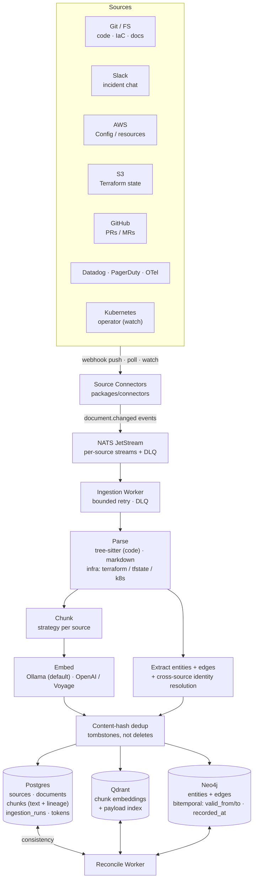
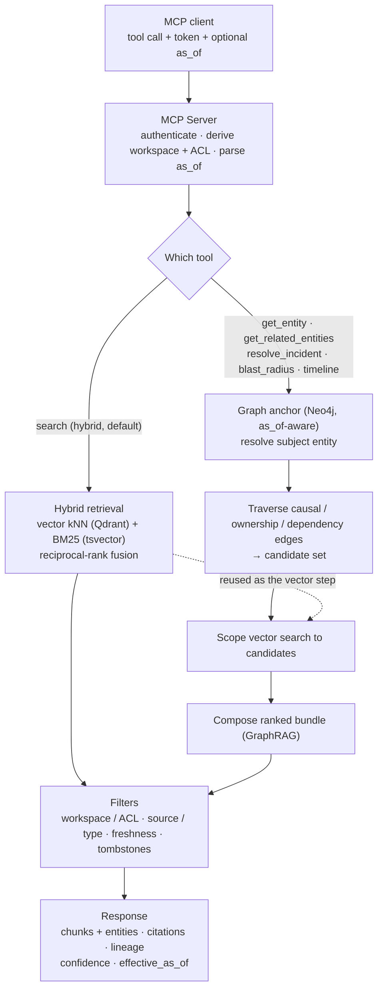

# Omniscience

**A self-hosted Living Semantic Core for platform & SRE teams.** Omniscience turns fragmented operational data — cloud infrastructure, IaC code, Kubernetes runtime, CI/CD, alerts, incident chat, docs — into a single **causal + temporal + semantic graph**, exposed through an **MCP-first API** to any MCP-compatible AI client (Claude Code, Cursor, Gemini, custom agents, or AI pipelines).

Retrieval-only by design: Omniscience returns **linked evidence with citations and confidence** — graph entities, related artifacts, and source chunks — and the calling LLM synthesizes the answer. No embedded LLM, no opinionated chat, no vendor lock-in. (Write actions against infrastructure are an explicit non-goal of this product; see Action Mode in [docs/vision.md](docs/vision.md#4-product-modes).)

## Why it exists

When a cluster degrades at 03:00, the bottleneck is **context assembly, not the fix**. Git knows what *should* be, Terraform what was *ordered*, Kubernetes what is *running*, Slack *why* it broke last time — and no single system says *these are the same entity*. AI agents layered on top of fragmented data produce plausible but ungrounded hypotheses. Omniscience links those sources into one graph an agent can traverse, so retrieval returns grounded, cited evidence instead of disconnected search hits.

## What it does

- **Hybrid knowledge graph** — **Neo4j** holds topology, ownership, dependency and causal edges plus temporal state; **Qdrant** holds semantic content (docs, Slack threads, post-mortems, commit messages, log narratives); **Postgres** holds operational metadata and lineage (sources, documents, chunk text, ingestion runs, tokens, workspaces).
- **GraphRAG composition** — the core query pattern: resolve the subject entity in the graph → traverse causal/ownership edges to candidate causes → scope a vector search to that candidate set → return a ranked, cited bundle. Substantively different from naive vector-only RAG and from static CMDB-style lookup.
- **Bitemporal time-travel** — every entity and edge carries `valid_from` / `valid_to` (real-world time) plus `recorded_at` (ingestion time). Query the graph **as it was at any `as_of` timestamp** ([ADR-0008](docs/decisions/0008-bitemporal-schema-for-neo4j.md)).
- **Cross-domain identity** — the same real-world thing gets one node identity across sources via declarative metadata (IaC address, ARN, labels), OpenTelemetry trace context, and ML clustering. Every cross-source link carries a **confidence score** with explicit strategy attribution.
- **SRE-shaped MCP tools** — beyond `search`: incident composition, timeline reconstruction, blast-radius traversal, point-in-time replay, runbook suggestion, similar-incident lookup, and post-mortem drafting (see table below).
- **Self-hosted, local-embedding default** — data never leaves your perimeter; Omniscience emits structured evidence for policy engines (OPA/Rego) rather than replacing them.

## MCP tool surface

The MCP contract is the primary interface ([full contracts](docs/api/mcp.md)). Current tools:

| Tool | Purpose | Notes |
|---|---|---|
| `search` | Hybrid vector + BM25 retrieval with filters | Workhorse; `as_of`-aware |
| `get_document` | Fetch a full document (all chunks) by id | |
| `get_entity` | Resolve one graph entity by name | `as_of`-aware, workspace-scoped |
| `get_related_entities` | Traverse the entity graph (BFS, edge-type filter) | `as_of`-aware, workspace-scoped |
| `resolve_incident` | Compose a recommendation bundle for an alert (target resource, responsible PR, Slack threads, confidence) | confidence score is a v0.1 placeholder ([#155](https://github.com/100rd/Omniscience/issues/155)) |
| `incident_timeline` | Reconstruct an incident timeline from the bitemporal graph | |
| `blast_radius` | Causal traversal + impact estimate from a seed | impact score is a v0.1 placeholder |
| `replay_context` | "What did the agent see at time T" — point-in-time replay | |
| `suggest_runbook` | Surface the runbook(s) matching an incident | |
| `find_similar_incidents` | Retrieve past incidents resembling the current one | |
| `generate_postmortem` | Draft a post-mortem from the incident graph | |
| `list_sources` / `source_stats` | Operational introspection + freshness | `sources:read` scope |

Tokens are scoped (`search`, `sources:read`, `sources:write`, `admin`); graph/incident tools require a workspace-scoped token.

## How data moves

From a source change to queryable graph + vector + metadata. Connectors emit change events onto NATS JetStream; the ingestion worker parses, chunks, embeds, and extracts entities/edges, then writes each store and a reconcile worker keeps them consistent. Content-hash dedup skips cosmetic changes; removals are tombstoned, not deleted.



## How retrieval works

Plain `search` runs hybrid retrieval (vector kNN + BM25, reciprocal-rank fusion). The graph and incident tools run **GraphRAG composition**: anchor on an entity in Neo4j (honoring `as_of`), traverse causal/ownership/dependency edges to a candidate set, scope the vector step to those candidates, then compose a ranked bundle. ACL/workspace, source, freshness, and tombstone filters apply to both; every response carries citations, lineage, confidence, and `effective_as_of`. See [ADR-0004](docs/decisions/0004-retrieval-strategy-staged.md).



> Diagrams render inline on GitHub. Component-level detail lives in [docs/architecture.md](docs/architecture.md).

## Status

**v0.2.0.** Backend split to **Neo4j + Qdrant + Postgres** (Epic #96 cutover). Bitemporal `as_of` is implemented and exercised across the MCP/REST surface; hybrid `search` is the production workhorse; graph traversal and the incident tools are live, with a few v0.1 placeholders maturing (calibrated `resolve_incident` confidence and `blast_radius` impact scoring). Infra connectors (AWS, S3 Terraform state) are in pilot; the native Kubernetes operator and desired-vs-actual drift detection are on the roadmap. See [docs/roadmap.md](docs/roadmap.md) (M0 → M6) and [docs/vision.md](docs/vision.md).

## Install (one line)

```bash
curl -fsSL https://raw.githubusercontent.com/100rd/Omniscience/main/.mcp/install.sh | bash
```

Starts the stack with Docker, mints secrets into `./omniscience/.env`, and waits for `/health`. Then wire it into your IDE in one shot:

```bash
uvx --from omniscience-cli omniscience init --client claude-code
# or: cursor, cline, zed, continue, gemini
```

Tested on macOS (Intel + Apple Silicon) and Linux (Ubuntu 22.04, Debian 12). See [docs/mcp-catalog-submission.md](docs/mcp-catalog-submission.md) for the catalog submission recipes.

## Getting Started

Get Omniscience running and connected to your AI client in three steps.

**Step 1 — Start the stack**

```bash
cat > .env << 'EOF'
POSTGRES_PASSWORD=change-me-strong-password
OMNISCIENCE_SECRET_KEY=change-me-32-char-secret-key-here
EOF

docker compose up -d
```

> **Lower the ops-burden for a first run.** The default stack runs five
> backing services. The **lite profile** trims it to the minimum (in-process
> embeddings, no Ollama/backup containers, background workers off,
> laptop-friendly memory):
>
> ```bash
> docker compose -f docker-compose.yml -f docker-compose.lite.yml up -d
> # or: make up-lite
> ```
>
> The full profile is unchanged — see [docs/architecture.md](docs/architecture.md#lite-deployment-profile).

Wait for all services to become healthy, then verify:

```bash
curl http://localhost:8000/health
# {"status":"ok","version":"0.2.0"}
```

**Step 2 — Create an API token**

```bash
docker compose exec app omniscience tokens create \
  --name my-client \
  --scopes search,sources:read
# Created token: sk_live_...  (save this — shown once)
```

**Step 3 — Connect your AI client**

Add this to your client's MCP config:

```json
{
  "mcpServers": {
    "omniscience": {
      "command": "omniscience",
      "args": ["mcp", "serve", "--transport", "stdio"],
      "env": {
        "OMNISCIENCE_URL": "http://localhost:8000",
        "OMNISCIENCE_TOKEN": "sk_live_..."
      }
    }
  }
}
```

Then ask your AI assistant a question — it will call `search` (and, for incident work, `resolve_incident` / `get_related_entities`) and return grounded answers with citations.

## Integration guides

| Client | Guide |
|---|---|
| Claude Code | [docs/integrations/claude-code.md](docs/integrations/claude-code.md) |
| Cursor | [docs/integrations/cursor.md](docs/integrations/cursor.md) |
| Gemini CLI / SDK | [docs/integrations/gemini.md](docs/integrations/gemini.md) |
| multiqlti pipelines | [docs/integrations/multiqlti.md](docs/integrations/multiqlti.md) |
| Python (direct MCP client) | [docs/integrations/python-client.md](docs/integrations/python-client.md) |
| LangGraph agents | [docs/integrations/langgraph.md](docs/integrations/langgraph.md) |
| CrewAI agents | [docs/integrations/crewai.md](docs/integrations/crewai.md) |
| PydanticAI agents | [docs/integrations/pydantic-ai.md](docs/integrations/pydantic-ai.md) |

## Quick links

- [Vision](docs/vision.md) — what Omniscience is and isn't (the canonical product description)
- [Architecture](docs/architecture.md) — components, data flow, retrieval
- [Roadmap](docs/roadmap.md) — milestones M0 → M6
- [MCP API](docs/api/mcp.md) — tool contracts (primary interface)
- [REST API](docs/api/rest.md) — secondary interface
- [Connector framework](docs/api/connector-sdk.md) — how to add a source
- [Database schema](docs/schema.md)
- [Freshness & lineage](docs/freshness-and-lineage.md) — trust model for AI clients
- [Retrieval strategy (ADR 0004)](docs/decisions/0004-retrieval-strategy-staged.md) — hybrid → structural → GraphRAG-if-needed
- [Bitemporal schema (ADR 0008)](docs/decisions/0008-bitemporal-schema-for-neo4j.md) — the `as_of` model
- [Architecture decisions](docs/decisions/)
- [MCP catalog submission tracker](docs/mcp-catalog-submission.md)

## Benchmarks

MCP retrieval-quality benchmark suite under [bench/](bench/) — 50-incident corpus + cross-vendor matrix.
Latest results: [bench/results/2026-Q2.md](bench/results/2026-Q2.md).

## License

Apache 2.0. See [LICENSE](LICENSE).
</content>
