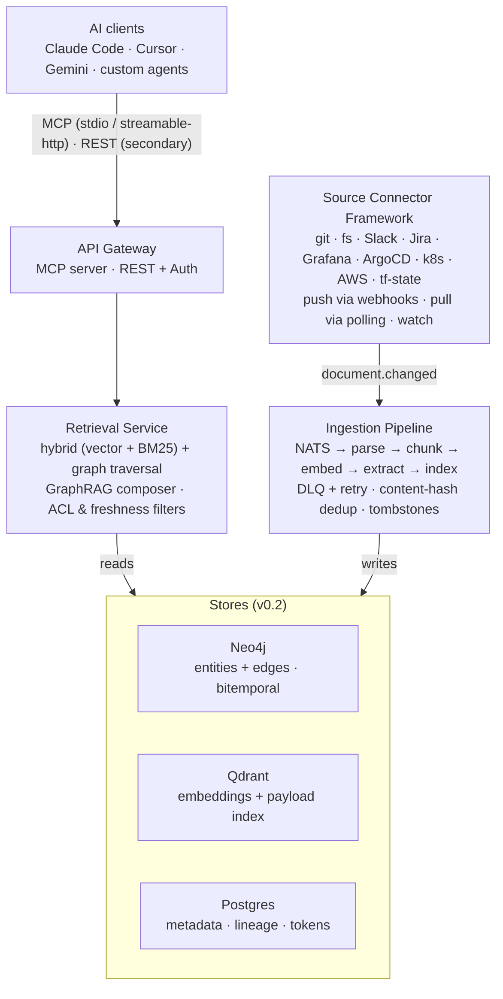
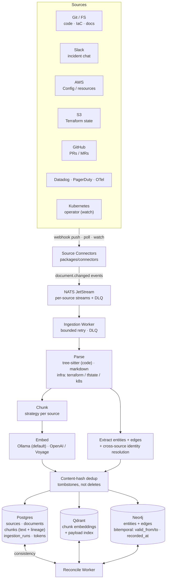
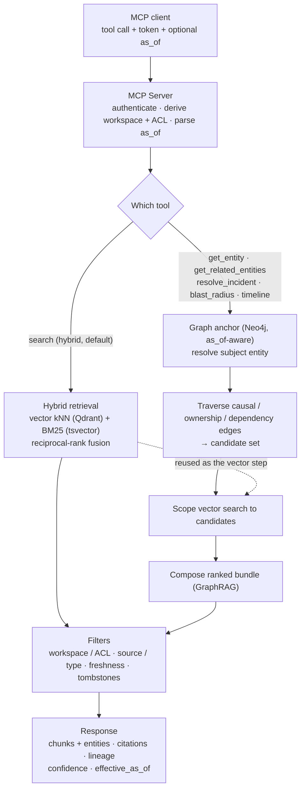

# Architecture

> **Status as of v0.2 (Epic #96 cutover, #105).** The diagrams and
> descriptions below have been updated to reflect the Neo4j +
> Qdrant backend split. Postgres is retained for **operational
> metadata only** — sources, documents (row-level), chunks (text
> + lineage), ingestion runs, API tokens, workspaces. All
> chunk-level embeddings live in Qdrant; all graph data (entities
> + edges) lives in Neo4j. Hybrid search is composed by
> `GraphRAGComposer` (ADR-0005 / ADR-0006). For the original v0.1
> layout with pgvector as the single store of truth, see the
> `v0.1.x` tag.

## System overview

## Components

### 1. Source connectors (`packages/connectors/`)

Pluggable adapters implementing a small interface. Each connector:

- Discovers documents in its source
- Emits change events (full list on first run, incremental after)
- Provides per-document content + metadata
- Handles source-specific auth (token, OAuth, service account)

Built-in for v0.1: `git`, `fs`. Next: Confluence, Notion, Slack, Jira, Grafana, k8s, Terraform state.

### 2. Ingestion pipeline (`apps/server/`, `packages/parsers/`)

Event-driven via NATS JetStream. Stages:

1. **Change detector** — connector emits `document.changed` with source_id + external_id
2. **Fetcher** — pulls content from source
3. **Parser** — source-type-aware (tree-sitter for code, markdown parsers for docs)
4. **Chunker** — strategy-per-source (function/class for code, section/heading for docs)
5. **Embedder** — provider-pluggable (Ollama default, OpenAI/Voyage optional)
6. **Indexer** — writes chunks + embeddings + metadata

Failures flow to DLQ. Retries are bounded with exponential backoff. Freshness SLO per source defines when staleness alerts fire.

### 3. Index layer (`packages/index/`)

Three specialized stores behind one writer (v0.2, Epic #96):

- **Postgres** — operational metadata: `sources`, `documents` (with `content_hash` + `tombstoned_at`), `chunks` (text + lineage), `ingestion_runs`, `api_tokens`, workspaces.
- **Qdrant** — chunk embeddings + payload index. Powers the vector leg of hybrid search and the exact `enumerate`/`count` path.
- **Neo4j** — entities + edges with the bitemporal triple (`valid_from`, `valid_to`, `recorded_at`); see [ADR-0008](decisions/0008-bitemporal-schema-for-neo4j.md).

A reconcile worker keeps the three stores consistent. (For the v0.1 single-store pgvector layout, see the `v0.1.x` tag.)

### 4. Retrieval service (`packages/retrieval/`)

Hybrid search — **staged**, see [ADR 0004](decisions/0004-retrieval-strategy-staged.md).

#### v0.1 — Hybrid baseline

1. **Vector** — pgvector HNSW top-K
2. **BM25-like** — tsvector ranking
3. **Merge** — reciprocal rank fusion
4. **Filter** — ACL, source subset, freshness cap

#### v0.2 — Adaptive retrieval

Add structural strategies using edges already present in source data (no LLM extraction):

- **Code**: imports, calls, class inheritance — from tree-sitter output
- **Infrastructure**: DEPENDS_ON from Terraform state, k8s ownerReferences, Helm chart deps
- **Docs**: markdown links, ADR supersedes
- **Cross-source entity linking**: resource-name matching across connectors

Storage: same Postgres, new `entities` + `edges` tables. Queries via recursive CTEs or Apache AGE (Cypher). **No separate graph database.**

Callers (or an internal `"auto"` classifier) select the strategy per query via the `retrieval_strategy` parameter.

#### v0.3+ — Full GraphRAG (optional, triggered by evidence)

LLM-extracted entities + community detection — only if v0.2 structural coverage leaves clear gaps on text-heavy sources (ADRs, post-mortems, wikis).

#### v0.3 — Re-ranking

Cross-encoder second pass over top-N to boost precision. Cheap quality win.

Returns chunks with citations and provenance.

### 5. API surfaces (`apps/server/`)

Two transports:

- **MCP server** (primary) — stdio + streamable-http. Tools: `search`, `get_document`, `get_entity`, `get_related_entities`, `resolve_incident`, `incident_timeline`, `blast_radius`, `replay_context`, `suggest_runbook`, `find_similar_incidents`, `generate_postmortem`, `list_sources`, `source_stats`. See [api/mcp.md](api/mcp.md).
- **REST** (secondary) — `/search`, `/sources`, `/documents/:id`, `/ingest/webhook/:source`, `/health`.

Both hit the same retrieval service.

### 6. CLI (`apps/cli/`)

`omniscience` command for operators: source management, manual reindex, ad-hoc search, status.

## Deployment

Single `docker-compose.yml` brings up:

- `app` — Omniscience server (FastAPI + FastMCP + ingestion workers)
- `postgres` with pgvector
- `nats` JetStream
- `ollama` (optional — if using local embeddings)
- `caddy` — TLS termination

Helm chart available for Kubernetes.

### Managed Postgres

Nothing in Omniscience requires the built-in Postgres. Any Postgres 14+ with pgvector works:

- **AWS RDS for PostgreSQL** — pgvector available as a managed extension
- **Google Cloud SQL** — pgvector extension supported
- **Supabase / Neon / Crunchy Bridge** — pgvector first-class
- **Aurora PostgreSQL** — pgvector supported

Set `DATABASE_URL` to the external instance; drop the `postgres` service from Compose. Daily `pg_dump` backup sidecar can be similarly disabled in favor of the managed provider's backup mechanism.

## Agent layer (for AgenticConnector only)

Most of Omniscience is deterministic. The exception is **AgenticConnector** — a connector variant whose `discover()` phase uses an LLM to decide what to index (see [ADR 0003](decisions/0003-agent-framework-langgraph-primary.md)).

- **v0.1**: LangGraph, with pluggable LLM provider (Gemini, Claude, Ollama)
- **v0.2**: CrewAI and PydanticAI adapters added
- **Layer B** (external users calling Omniscience from their agent code): uses MCP directly, no Omniscience-side abstraction — see [integrations/](integrations/)

## Data flow: a source update

Connectors emit change events onto NATS JetStream; the ingestion worker parses, chunks,
embeds, and extracts entities/edges, then writes each store and a reconcile worker keeps
them consistent. Content-hash dedup skips cosmetic changes; removals are tombstoned, not deleted.

## Data flow: a search query

Plain `search` runs hybrid retrieval (vector kNN + BM25, reciprocal-rank fusion). The graph
and incident tools run **GraphRAG composition**: anchor on an entity in Neo4j (honoring
`as_of`), traverse causal/ownership/dependency edges to a candidate set, scope the vector step
to those candidates, then compose a ranked bundle. ACL/workspace, source, freshness, and
tombstone filters apply to both; every response carries citations, lineage, confidence, and
`effective_as_of`. See [ADR-0004](decisions/0004-retrieval-strategy-staged.md).

## Multi-tenancy (v0.2+)

Workspaces (tenants) separate at the query and ingestion level. Each source belongs to a workspace; each API token is scoped. Single-tenant MVP hides this behind a default workspace.

## See also

- [Schema](schema.md)
- [MCP API](api/mcp.md)
- [Connector SDK](api/connector-sdk.md)
- [ADR 0001: Language & stack](decisions/0001-language-and-stack.md)
