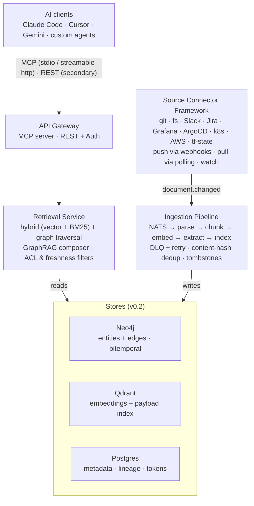
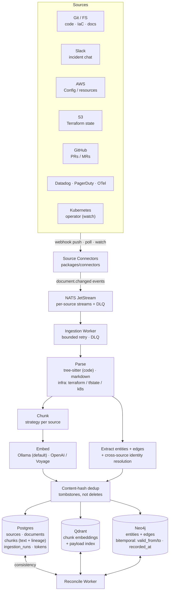
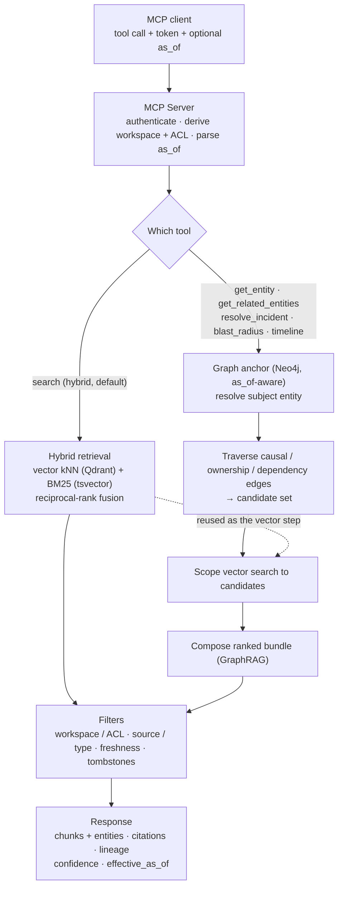

# Architecture

> **Status as of v0.2 (Epic #96 cutover, #105).** The diagrams and
> descriptions below have been updated to reflect the Neo4j +
> Qdrant backend split. Postgres is retained for **operational
> metadata only** — sources, documents (row-level), chunks (text
> + lineage), ingestion runs, API tokens, workspaces. All
> chunk-level embeddings live in Qdrant; all graph data (entities
> + edges) lives in Neo4j. Hybrid search is composed by
> `GraphRAGComposer` (ADR-0005 / ADR-0006). For the original v0.1
> layout with pgvector as the single store of truth, see the
> `v0.1.x` tag.

## System overview



## Components

### 1. Source connectors (`packages/connectors/`)

Pluggable adapters implementing a small interface. Each connector:

- Discovers documents in its source
- Emits change events (full list on first run, incremental after)
- Provides per-document content + metadata
- Handles source-specific auth (token, OAuth, service account)

Built-in for v0.1: `git`, `fs`. Next: Confluence, Notion, Slack, Jira, Grafana, k8s, Terraform state.

### 2. Ingestion pipeline (`apps/server/`, `packages/parsers/`)

Event-driven via NATS JetStream. Stages:

1. **Change detector** — connector emits `document.changed` with source_id + external_id
2. **Fetcher** — pulls content from source
3. **Parser** — source-type-aware (tree-sitter for code, markdown parsers for docs)
4. **Chunker** — strategy-per-source (function/class for code, section/heading for docs)
5. **Embedder** — provider-pluggable (Ollama default, OpenAI/Voyage optional)
6. **Indexer** — writes chunks + embeddings + metadata

Failures flow to DLQ. Retries are bounded with exponential backoff. Freshness SLO per source defines when staleness alerts fire.

### 3. Index layer (`packages/index/`)

**v0.2+ backend split** (ADR-0005 + ADR-0006; see also [ADR-0008](decisions/0008-bitemporal-schema-for-neo4j.md)):

- **Postgres** (`documents`, `chunks`, `ingestion_runs`, `sources`) — operational metadata, lineage, content-hash dedup, tombstones. No embeddings column after cutover.
- **Qdrant** — chunk embeddings (named vector `dense_primary`) + sparse BM25 vectors (named vector `sparse_bm25`) + per-point payload (workspace_id, source_id, text, metadata, bitemporal fields). One collection per embedding model × dimension.
- **Neo4j** — entities, edges, ownership / dependency graph. Bitemporal properties (`valid_from`, `valid_to`, `recorded_at`) per ADR-0008.

**Bitemporal write path** (Stage 1, `refactor/bitemporal-vector-hybrid`): when a document's `content_hash` changes, old Qdrant points are **end-dated** (`valid_to = now()`) rather than hard-deleted. `as_of=T` queries on Qdrant return the chunk version valid at T, consistent with the Neo4j graph state at T (ADR-0008 §6).

**Enumerate mode** (Stage 4): `enumerate_chunks` / `count_enumerate` bypass HNSW and use Qdrant payload indexes + `count(exact=True)` + `scroll` for 100% recall on "list all X / count all Y" queries.

### 4. Retrieval service (`packages/retrieval/`)

Hybrid search — **staged**, see [ADR-0004](decisions/0004-retrieval-strategy-staged.md) and its Stage 3 amendment.

`GraphRAGComposer` dispatches per `retrieval_strategy`:

| `retrieval_strategy` | Dense (Qdrant HNSW) | Sparse (Qdrant BM25) | Graph (Neo4j) |
|---|---|---|---|
| `"hybrid"` (default) | yes | yes — RRF merge | anchor stage |
| `"auto"` | yes | yes — RRF merge | anchor stage |
| `"keyword"` | no | yes — sparse only | anchor stage |
| `"structural"` | yes — dense only | no | anchor stage |

**RRF merge** (k=60, Cormack et al. 2009): `score(d) = Σ 1/(60 + rank_i(d))` over dense and sparse ranked lists. Graph-affinity re-scoring is applied on top by `GraphRAGComposer._run_merge_stage`.

**`retrieval_strategy` was accepted but ignored before Stage 3** (branch `refactor/bitemporal-vector-hybrid`). All four values now drive real dispatch.

**Bitemporal search** (`as_of` parameter): both graph traversal and Qdrant vector search honour `as_of=T`, returning the system state as it was at T. The open-closed predicate `valid_from <= T AND (T < valid_to OR valid_to IS NULL)` is applied via `QdrantFilterBuilder.with_as_of()`.

**Degraded detector**: when an anchor entity is not found in the graph at `as_of` AND the vector layer also returns empty, `SearchResult.meta.degraded_response = "as_of_before_recorded_history"` signals that the query precedes any recorded history for that entity. After Stage 1 end-dating this is a genuine signal — not a content-rewrite artefact.

Returns chunks with citations and provenance.

### 5. API surfaces (`apps/server/`)

Two transports:

- **MCP server** (primary) — stdio + streamable-http. Tools: `search`, `get_document`, `get_related_entities`, `get_entity`, `list_entities`, `list_sources`, `source_stats`, `resolve_incident`, `incident_timeline`, `blast_radius`, `replay_context`, `suggest_runbook`, `find_similar_incidents`, `generate_postmortem`. See [api/mcp.md](api/mcp.md).
- **REST** (secondary) — `/search`, `/sources`, `/documents/:id`, `/ingest/webhook/:source`, `/health`.

Both hit the same retrieval service.

### 6. CLI (`apps/cli/`)

`omniscience` command for operators: source management, manual reindex, ad-hoc search, status.

## Deployment

Single `docker-compose.yml` brings up:

- `app` — Omniscience server (FastAPI + FastMCP + ingestion workers)
- `postgres` (`postgres:16-alpine`) — operational metadata only; no pgvector extension as of v0.2 (#105)
- `neo4j` — entity + edge graph (bitemporal)
- `qdrant` — chunk embeddings + payload index (vector search)
- `nats` JetStream
- `ollama` (optional — if using local embeddings)
- `caddy` — TLS termination

Helm chart available for Kubernetes. For a trimmed first-run / evaluation
stack, see the [Lite deployment profile](#lite-deployment-profile) below.

### Managed Postgres

Nothing in Omniscience requires the built-in Postgres. Postgres holds operational
metadata only (sources, documents, chunk text + lineage, ingestion runs, tokens,
workspaces) — embeddings live in Qdrant and the graph lives in Neo4j as of v0.2
(#105), so the `pgvector` extension is **no longer required**. Any standard
Postgres 14+ works:

- **AWS RDS for PostgreSQL**
- **Google Cloud SQL**
- **Supabase / Neon / Crunchy Bridge**
- **Aurora PostgreSQL**

Set `DATABASE_URL` to the external instance; drop the `postgres` service from Compose. Daily `pg_dump` backup sidecar can be similarly disabled in favor of the managed provider's backup mechanism.

### Lite deployment profile

The full stack runs five backing services (Postgres + Neo4j + Qdrant + NATS
JetStream + Ollama), which is a meaningful ops-burden just to evaluate the
system (issue #319). The **lite profile** trims that to the minimum required
for a working install, without forking the application or changing the full
profile's behaviour.

Bring it up by layering the `docker-compose.lite.yml` override on the base
file:

```bash
docker compose -f docker-compose.yml -f docker-compose.lite.yml up -d
# or, for the published-image variant:
docker compose -f docker-compose.prod.yml -f docker-compose.lite.yml up -d
```

What the override changes versus the default `docker compose up`:

| Aspect | Full profile | Lite profile |
|---|---|---|
| Embeddings | `ollama` + `ollama-pull` containers | in-process `sentence-transformers` (`EMBEDDING_PROVIDER=local`) — no extra container, no model pull, no GPU, no API key |
| Postgres backups | `pgbackup` sidecar (daily `pg_dump`) | disabled (eval data is disposable) |
| Discovery worker | on | off (`DISCOVERY_ENABLED=false`) |
| Reconcile worker | on | off (`RECONCILE_ENABLED=false`) |
| Scheduler worker | on | off (`SCHEDULER_ENABLED=false`) |
| Retention worker | on | off (`RETENTION_ENABLED=false`) |
| Neo4j memory | 1G/2G/1G heap/pagecache | 512m/512m/256m (laptop-friendly) |
| Running containers | 9 | 6 (`postgres`, `nats`, `neo4j`, `qdrant`, `app`, `admin`) |

`postgres`, `nats`, `neo4j`, and `qdrant` are **kept** — the application opens
connections to all four at startup (`apps/server/.../app.py::_lifespan`), so
they are hard runtime dependencies rather than optional add-ons. Consolidating
them into a single embedded store (SQLite/DuckDB) is a larger architectural
change tracked separately; the lite profile is the low-risk first step.

The background-worker switches (`discovery_enabled`, `reconcile_enabled`,
`scheduler_enabled`, `retention_enabled` in `omniscience_core.config.Settings`)
all default to **`True`**, so the only thing that disables them is this
override — a stock `docker compose up` is byte-for-byte unchanged. Re-enable any
of them in lite by setting the corresponding `*_ENABLED=true` env var.

To re-attach the optional containers without leaving lite, activate their
parked profiles, e.g. `--profile full-embeddings` (Ollama) or `--profile
backups` (pgbackup).

For an even lower-ops path, combine the lite profile with **managed Postgres**
(above): point `DATABASE_URL` at RDS/Cloud SQL/Neon and drop the `postgres`
service, leaving only NATS + Neo4j + Qdrant to self-host.

## Agent layer (for AgenticConnector only)

Most of Omniscience is deterministic. The exception is **AgenticConnector** — a connector variant whose `discover()` phase uses an LLM to decide what to index (see [ADR 0003](decisions/0003-agent-framework-langgraph-primary.md)).

- **v0.1**: LangGraph, with pluggable LLM provider (Gemini, Claude, Ollama)
- **v0.2**: CrewAI and PydanticAI adapters added
- **Layer B** (external users calling Omniscience from their agent code): uses MCP directly, no Omniscience-side abstraction — see [integrations/](integrations/)

## Data flow: a source update

Connectors emit change events onto NATS JetStream; the ingestion worker parses, chunks,
embeds, and extracts entities/edges, then writes each store and a reconcile worker keeps
them consistent. Content-hash dedup skips cosmetic changes; removals are tombstoned, not deleted.



## Data flow: a search query

Plain `search` runs hybrid retrieval (vector kNN + BM25, reciprocal-rank fusion). The graph
and incident tools run **GraphRAG composition**: anchor on an entity in Neo4j (honoring
`as_of`), traverse causal/ownership/dependency edges to a candidate set, scope the vector step
to those candidates, then compose a ranked bundle. ACL/workspace, source, freshness, and
tombstone filters apply to both; every response carries citations, lineage, confidence, and
`effective_as_of`. See [ADR-0004](decisions/0004-retrieval-strategy-staged.md).



## Multi-tenancy (v0.2+)

Workspaces (tenants) separate at the query and ingestion level. Each source belongs to a workspace; each API token is scoped. Single-tenant MVP hides this behind a default workspace.

## See also

- [Schema](schema.md)
- [MCP API](api/mcp.md)
- [Connector SDK](api/connector-sdk.md)
- [ADR 0001: Language & stack](decisions/0001-language-and-stack.md)
